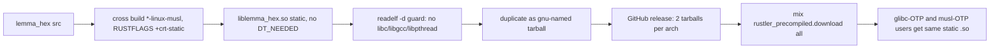

## Goal

Eliminate glibc from precompiled `lemma_hex` NIFs. Replace the gnu cross-compile pipeline with musl + `+crt-static`. Single static `.so` per arch, served under both `linux-gnu` and `linux-musl` filenames so all Linux OTP populations resolve to the same zero-dep binary.

## Replace vs add

Confirmed: this is replacement, not addition.

- Build pipeline: gnu cross images and gnu rustc targets are GONE. Only `*-unknown-linux-musl` remain. No glibc anywhere in CI.
- `linux-gnu` survives only as a six-character filename suffix on the released tarball, because `rustler_precompiled` looks up `:erlang.system_info(:system_architecture)` which is baked into stock OTP as `*-pc-linux-gnu`. The bytes behind that filename are 100% musl-static.
- `linux-musl` filename added because cost is one `cp` and one extra hex line per arch, and Alpine OTP users (`hexpm/elixir:*-alpine`, `erlang:*-alpine`, Distroless) get a working precompiled NIF instead of source-fallback.

## Strategy diagram



## File changes

### 1. `engine/packages/hex/native/lemma_hex/Cargo.toml`

Disable `lemma-engine` default features. `lemma-engine` declares `default = ["registry"]` → `registry = ["reqwest"]`, which pulls in rustls and aws-lc-rs C code. The NIF source has zero `reqwest|registry|tokio` references (grepped), so disabling is safe.

```toml
lemma-engine = { path = "../../../../", default-features = false }
```

The `xtask hex-standalone` rewrite handles this correctly: `pin_path_deps_to_workspace_version` only removes the `path` key and inserts `version`; all other keys including `default-features` are preserved. The existing `pins_path_dep_with_extra_fields` test only covers `features = [...]`, not `default-features`, so a new test must be added (see todo `verify-rewrite`).

### 2. `.cargo/config.toml`

Force `+crt-static` for musl. Cdylib + musl does NOT default to crt-static the way bins do.

```toml
[target.x86_64-unknown-linux-musl]
rustflags = ["-C", "target-feature=+crt-static"]

[target.aarch64-unknown-linux-musl]
rustflags = ["-C", "target-feature=+crt-static"]
```

This config is global (affects all crates targeting these triples). For CLI bins the flag is redundant — musl bins default to static — but harmless. For the NIF `cdylib` it is essential.

### 3. `engine/packages/hex/lib/lemma/native.ex`

Add the two musl triples to the existing `targets:` list (gnu entries stay only as URL-routing keys for stock-OTP lookup; the binary behind those filenames is musl-static):

```
aarch64-apple-darwin
x86_64-apple-darwin
aarch64-unknown-linux-gnu
x86_64-unknown-linux-gnu
aarch64-unknown-linux-musl
x86_64-unknown-linux-musl
x86_64-pc-windows-msvc
```

### 4. `.github/workflows/release.yml` `build-nif-binaries`

**Matrix change.** Replace the two `linux-gnu` entries with `linux-musl`. Both need `use-cross: true`. Note: the current `x86_64-unknown-linux-gnu` entry has no `use-cross` key and builds natively on `ubuntu-latest`; adding `use-cross: true` for the `x86_64-unknown-linux-musl` replacement is a behavioural change (now runs in a cross Docker container).

```yaml
- { target: aarch64-unknown-linux-musl, os: ubuntu-latest, use-cross: true }
- { target: x86_64-unknown-linux-musl,  os: ubuntu-latest, use-cross: true }
```

**Verification step** (Linux-only, runs before packaging):

```bash
SO="target/${{ matrix.job.target }}/release/liblemma_hex.so"
readelf -d "$SO" | tee /tmp/dyn.txt
if grep -E 'NEEDED.*lib(c|gcc_s|pthread|m|dl|rt)\.so' /tmp/dyn.txt; then
  echo "error: NIF has dynamic libc/libgcc deps"; exit 1
fi
```

Gated with `if: contains(matrix.job.target, 'linux-musl')` so it only runs on Linux steps where `readelf` is available.

**Packaging step** — produce musl tarball then duplicate as gnu-named tarball. Both files are picked up by the existing `files: "*lemma_hex-*.tar.gz"` upload glob:

```bash
VERSION="${{ needs.detect-version-changes.outputs.version }}"
NIF_VERSION="${{ matrix.nif }}"
TARGET="${{ matrix.job.target }}"
RELEASE_DIR="target/${TARGET}/release"

MUSL_NAME="liblemma_hex-v${VERSION}-nif-${NIF_VERSION}-${TARGET}.so"
cp "${RELEASE_DIR}/liblemma_hex.so" "${MUSL_NAME}"
tar czf "${MUSL_NAME}.tar.gz" "${MUSL_NAME}"

# Alias for stock OTP which reports *-pc-linux-gnu in system_architecture
GNU_NAME="${MUSL_NAME/linux-musl/linux-gnu}"
cp "${MUSL_NAME}" "${GNU_NAME}"
tar czf "${GNU_NAME}.tar.gz" "${GNU_NAME}"
```

`publish-hex` job needs no change — `mix rustler_precompiled.download Lemma.Native --all` fetches all 7 tarballs (3 native + 2 musl-built + 2 gnu-aliased copies) and writes the unified checksum file.

## Verification

- Add `pins_path_dep_with_default_features_false` test to `xtask/src/hex_standalone.rs`, then run `cargo nextest run -p xtask` — asserts `default-features = false` survives the rewrite.
- CI `readelf` guard fails loudly if any future dep introduces dynamic linkage.
- `mix rustler_precompiled.download` will fail if any expected tarball is missing.

## Out of scope

- macOS/Windows NIFs untouched (stable system ABIs, no glibc-equivalent problem).
- CLI musl builds untouched (already static).
- Source-build fallback continues to work via standalone-rewritten `Cargo.toml`.
